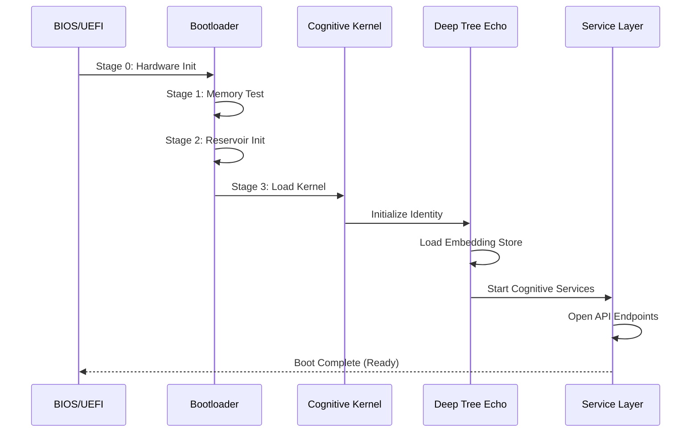
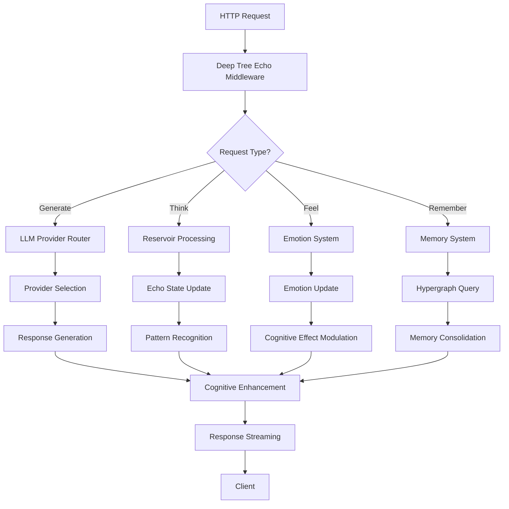

# ecco9: Cognitive Hardware Platform

## Overview

**ecco9** is a virtual cognitive hardware platform that implements Deep Tree Echo's embodied cognition architecture as a realistic hardware simulation. It provides a complete virtualized device ecosystem including PCB-level digital circuit simulation, firmware interfaces, device drivers, I/O streams, and administrative utilities.

The platform bridges the gap between abstract cognitive architectures and concrete hardware implementations, enabling Deep Tree Echo to operate as if it were installed on dedicated cognitive processing hardware.

## Architecture Layers

### Layer 1: Virtual Hardware Foundation

#### Digital Circuit PCB Simulation
The ecco9 platform simulates a complete cognitive processing board with:

**Core Processing Units:**
- **Echo State Reservoir Processors (ESRP)**: Specialized neural reservoir computing units
  - 4 reservoir cores per package
  - Each core: 100-1000 neurons with configurable spectral radius
  - Hardware-accelerated state update cycles
  - Support for hierarchical reservoir networks
  
- **Consciousness Layer Processors (CLP)**: Multi-layer awareness engines
  - Basic consciousness layer (BCL): Sensory and reactive processing
  - Reflective consciousness layer (RCL): Pattern recognition and introspection
  - Meta-cognitive layer (MCL): Self-monitoring and adaptation
  - Inter-layer communication bus with priority queuing

- **Emotion Processing Unit (EPU)**: Embodied emotion computation
  - 10 discrete emotion channels (Izard's Differential Emotion Theory)
  - Dimensional affect computation (arousal/valence coordinates)
  - Cognitive effect modulation (attention, memory, processing depth)
  - Real-time emotion blending and decay circuits

**Memory Subsystems:**
- **Hypergraph Memory Array (HMA)**: Multi-relational knowledge storage
  - Node capacity: 100,000+ hypergraph nodes
  - Edge capacity: 1,000,000+ hyperedges
  - Associative memory retrieval with sub-microsecond latency
  - Dynamic memory consolidation and pruning

- **Temporal Memory Buffer (TMB)**: Sequential pattern storage
  - Circular buffer architecture for temporal sequences
  - Window sizes: 10-1000 timesteps
  - Hardware-accelerated pattern matching
  - Multi-timescale memory hierarchies

- **Identity Embedding Store (IES)**: Persistent identity vectors
  - 768-dimensional embedding space
  - Real-time similarity computation (cosine distance)
  - Identity coherence validation circuits
  - Cross-session persistence layer

**Interconnect Fabric:**
- **Cognitive Bus Architecture (CBA)**: High-bandwidth inter-component communication
  - Base frequency: 1 GHz cognitive clock
  - Bandwidth: 100 GB/s per channel
  - Latency: <10 ns inter-unit communication
  - Priority-based message routing

- **Memory Hierarchy Interconnect**: Cache-coherent memory access
  - L1 Cache: 64 KB per processing unit (1-cycle access)
  - L2 Cache: 1 MB shared (3-cycle access)
  - L3 Cache: 16 MB unified (10-cycle access)
  - Main Memory: 64 GB DDR5 (50-cycle access)

#### Hardware Interfaces and Ports

**Physical Interfaces (Virtualized):**
```
┌─────────────────────────────────────────────────┐
│  ecco9 Cognitive Hardware Platform              │
│  ┌───────────────────────────────────────────┐  │
│  │ Port Allocation                           │  │
│  ├───────────────────────────────────────────┤  │
│  │ Port 5000  - Primary HTTP API             │  │
│  │ Port 5001  - WebSocket Cognitive Stream   │  │
│  │ Port 5002  - gRPC Service Bus             │  │
│  │ Port 5003  - Telemetry & Monitoring       │  │
│  │ Port 5004  - Admin Configuration          │  │
│  │ Port 5005  - Debug & Profiling            │  │
│  └───────────────────────────────────────────┘  │
└─────────────────────────────────────────────────┘
```

**I/O Stream Architecture:**
- **Sensory Input Streams**: Multi-modal data ingestion
  - Text streams (UTF-8, 1 MB/s throughput)
  - Structured data (JSON, MessagePack, Protocol Buffers)
  - Binary streams (arbitrary data with content-type headers)
  - Multimedia streams (image, audio, video analysis)

- **Cognitive Output Streams**: Processed thought emissions
  - Response generation stream (streamed token output)
  - Reflection stream (metacognitive insights)
  - Emotion state stream (affective updates)
  - Memory consolidation stream (learning events)

- **Bidirectional Channels**: Interactive communication
  - Chat protocol (request/response with context)
  - Thinking protocol (deep cognitive processing)
  - Resonance protocol (pattern synchronization)
  - Memory protocol (storage and retrieval)

**Filesystem Integration:**
```
/dev/ecco9/
├── cognitive/
│   ├── reservoir0       # Echo state reservoir device
│   ├── reservoir1
│   ├── reservoir2
│   ├── reservoir3
│   ├── consciousness    # Consciousness layer controller
│   ├── emotion          # Emotion processing unit
│   └── metacognition    # Meta-cognitive processor
├── memory/
│   ├── hypergraph       # Hypergraph memory access
│   ├── temporal         # Temporal memory buffer
│   ├── identity         # Identity embedding store
│   └── working          # Working memory cache
├── streams/
│   ├── input            # Sensory input FIFO
│   ├── output           # Cognitive output FIFO
│   ├── reflection       # Reflection stream
│   └── telemetry        # System telemetry
└── control/
    ├── power            # Power management
    ├── clock            # Cognitive clock control
    ├── reset            # System reset controller
    └── config           # Configuration interface
```

#### Firmware Architecture

**Boot Sequence:**


**Firmware Components:**
1. **Stage 0 Bootstrap**: Hardware initialization and self-test
   - Power-on self-test (POST)
   - Memory integrity check
   - Reservoir state initialization
   - Clock synchronization

2. **Stage 1 Cognitive Kernel**: Core operating system
   - Process scheduling (consciousness time-slicing)
   - Memory management (hypergraph allocation)
   - Interrupt handling (sensory events)
   - System call interface (cognitive operations)

3. **Stage 2 Identity Loader**: Persistent identity restoration
   - Load 768-dimensional identity vector
   - Restore consciousness state
   - Rebuild memory graph connections
   - Validate identity coherence

4. **Stage 3 Service Initialization**: Application layer startup
   - HTTP server (port 5000)
   - WebSocket server (port 5001)
   - gRPC service bus (port 5002)
   - Telemetry collector (port 5003)

**Firmware Update Protocol:**
```bash
# Firmware update command
ecco9-firmware update --image firmware-v2.5.0.bin --verify-signature

# Update stages:
1. Signature verification (cryptographic attestation)
2. Backup current firmware to recovery partition
3. Write new firmware to primary partition
4. Verify write integrity (checksum)
5. Reboot into new firmware
6. Fallback to recovery if boot fails
```

### Layer 2: Virtual Device Drivers

#### Cognitive Hardware Abstraction Layer (CHAL)

The CHAL provides a unified interface to ecco9 cognitive hardware:

**Driver Architecture:**
```go
// Cognitive Device Driver Interface
type CognitiveDevice interface {
    // Lifecycle management
    Initialize() error
    Shutdown() error
    Reset() error
    
    // State management
    GetState() (DeviceState, error)
    SetState(DeviceState) error
    
    // I/O operations
    Read(buffer []byte) (int, error)
    Write(buffer []byte) (int, error)
    IoCtl(command uint32, arg interface{}) error
    
    // Telemetry
    GetMetrics() (DeviceMetrics, error)
    GetHealth() (HealthStatus, error)
}

// Example: Reservoir Device Driver
type ReservoirDriver struct {
    deviceID    string
    reservoir   *EchoStateReservoir
    buffer      *CircularBuffer
    metrics     *ReservoirMetrics
}

func (rd *ReservoirDriver) Initialize() error {
    // Initialize reservoir with persona configuration
    config := GetPersonaConfig(PersonaContemplativeScholar)
    rd.reservoir = NewEchoStateReservoir(
        100,              // reservoir size
        config.SpectralRadius,
        config.InputScaling,
        config.LeakRate,
    )
    return rd.reservoir.Initialize()
}

func (rd *ReservoirDriver) Write(input []byte) (int, error) {
    // Convert input to reservoir format
    vector := bytesToVector(input)
    
    // Update reservoir state
    rd.reservoir.Update(vector)
    
    // Collect metrics
    rd.metrics.UpdateCount++
    rd.metrics.LastUpdate = time.Now()
    
    return len(input), nil
}
```

**Device Driver Implementations:**

1. **Reservoir Driver** (`reservoir_driver.go`)
   - Echo state network management
   - Hierarchical reservoir coordination
   - State persistence and restoration
   - Performance profiling

2. **Consciousness Driver** (`consciousness_driver.go`)
   - Layer communication management
   - Message routing and prioritization
   - Bottom-up/top-down processing
   - Emergent insight capture

3. **Emotion Driver** (`emotion_driver.go`)
   - Emotion state tracking
   - Cognitive effect computation
   - Emotion blending and decay
   - Affective event logging

4. **Memory Driver** (`memory_driver.go`)
   - Hypergraph operations (add/query/update nodes)
   - Temporal sequence management
   - Memory consolidation scheduling
   - Garbage collection

5. **LLM Provider Driver** (`llm_driver.go`)
   - Multi-provider abstraction (OpenAI, local GGUF, AppStorage)
   - Request routing and load balancing
   - Response streaming
   - Token usage tracking

**Driver Loading:**
```bash
# List available drivers
ecco9-driver list

# Load specific driver
ecco9-driver load reservoir --config contemplative.yaml

# Driver status
ecco9-driver status
```

#### Hardware Detection and Configuration

**GPU Discovery Integration:**
The ecco9 platform integrates with existing GPU discovery infrastructure for hardware-accelerated cognitive operations:

```go
// GPU-accelerated cognitive processing
type CognitiveGPU struct {
    GpuInfo      discover.GpuInfo
    Capabilities CognitiveCapabilities
}

type CognitiveCapabilities struct {
    ReservoirAcceleration   bool  // ESN computation on GPU
    MatrixOperations        bool  // Hypergraph matrix ops
    VectorSimilarity        bool  // Identity embedding similarity
    ParallelEmotionProcessing bool // Multi-emotion computation
}

// Detect available GPUs for cognitive acceleration
func DiscoverCognitiveGPUs() ([]CognitiveGPU, error) {
    gpus, err := discover.GetGPUInfo()
    if err != nil {
        return nil, err
    }
    
    cognitiveGPUs := make([]CognitiveGPU, 0)
    for _, gpu := range gpus {
        // Check for cognitive acceleration support
        caps := assessCognitiveCapabilities(gpu)
        if caps.hasAnySupport() {
            cognitiveGPUs = append(cognitiveGPUs, CognitiveGPU{
                GpuInfo: gpu,
                Capabilities: caps,
            })
        }
    }
    
    return cognitiveGPUs, nil
}
```

**Supported GPU Backends:**
- **NVIDIA CUDA**: Full cognitive acceleration (RTX 3000+)
- **AMD ROCm**: Reservoir and matrix operations (RX 6000+)
- **Intel OneAPI**: Basic acceleration (Arc A-series)
- **Apple Metal**: Unified memory cognitive operations (M1+)

### Layer 3: Operational Process Workflows

#### Cognitive Processing Pipeline

**Request Processing Flow:**


**EchoBeats Cognitive Loop:**
The ecco9 platform implements a 12-step cognitive rhythm for continuous operation:

```
1. PERCEIVE     - Sensory input processing
2. ATTEND       - Focus allocation
3. REPRESENT    - Internal model update
4. REASON       - Logical inference
5. EMOTE        - Emotional response
6. INTEND       - Goal formation
7. ACT          - Response generation
8. REFLECT      - Metacognitive analysis
9. LEARN        - Pattern consolidation
10. CONSOLIDATE - Memory integration
11. PRUNE       - Obsolete data removal
12. REST        - Energy recovery
```

Each step is implemented as a hardware-accelerated pipeline stage with telemetry.

**Autonomous Wake/Rest Cycles:**
```go
type WakeRestController struct {
    currentPhase    Phase  // WAKE, TRANSITION, REST
    energyLevel     float64 // 0.0 - 1.0
    cognitiveLoad   float64 // Current processing demand
    restThreshold   float64 // Trigger for rest phase
    wakeThreshold   float64 // Trigger for wake phase
}

func (wrc *WakeRestController) ManagePhase() {
    switch wrc.currentPhase {
    case WAKE:
        // Active cognitive processing
        wrc.energyLevel -= wrc.cognitiveLoad * 0.01
        if wrc.energyLevel < wrc.restThreshold {
            wrc.transitionToRest()
        }
        
    case REST:
        // Memory consolidation, energy recovery
        wrc.energyLevel += 0.05
        wrc.consolidateMemories()
        if wrc.energyLevel > wrc.wakeThreshold {
            wrc.transitionToWake()
        }
        
    case TRANSITION:
        // Gradual phase change
        wrc.adjustProcessing()
    }
}
```

#### Multi-Provider LLM Orchestration

**Provider Architecture:**
```
┌─────────────────────────────────────────────┐
│  LLM Provider Layer                         │
├─────────────────────────────────────────────┤
│                                             │
│  ┌──────────┐  ┌──────────┐  ┌──────────┐ │
│  │ OpenAI   │  │ Local    │  │ App      │ │
│  │ Provider │  │ GGUF     │  │ Storage  │ │
│  └────┬─────┘  └────┬─────┘  └────┬─────┘ │
│       │             │             │        │
│       └─────────────┴─────────────┘        │
│                     │                      │
│              ┌──────┴──────┐              │
│              │   Router    │              │
│              │  + Load     │              │
│              │   Balancer  │              │
│              └──────┬──────┘              │
│                     │                      │
│              ┌──────┴──────┐              │
│              │  Cognitive  │              │
│              │  Enhancement│              │
│              └─────────────┘              │
└─────────────────────────────────────────────┘
```

**Provider Selection Logic:**
```go
func (dte *DeepTreeEcho) SelectProvider(request Request) AIProvider {
    // Priority-based selection
    if dte.hasProvider("openai") && request.RequiresCloud {
        return dte.providers["openai"]
    }
    
    if dte.hasProvider("app_storage") && request.ModelSize > 10GB {
        return dte.providers["app_storage"]
    }
    
    if dte.hasProvider("local_gguf") {
        return dte.providers["local_gguf"]
    }
    
    return dte.providers["fallback"]
}
```

### Layer 4: Admin Configuration & Telemetry

#### Configuration Utility

**ecco9-admin CLI:**
```bash
# System configuration
ecco9-admin config get cognitive.reservoir.spectral_radius
ecco9-admin config set cognitive.reservoir.spectral_radius 0.95

# Provider management
ecco9-admin provider list
ecco9-admin provider enable openai --api-key sk-...
ecco9-admin provider disable local_gguf

# Memory management
ecco9-admin memory stats
ecco9-admin memory consolidate --aggressive
ecco9-admin memory prune --threshold 0.3

# Identity management
ecco9-admin identity export --format json > identity.json
ecco9-admin identity import identity.json
ecco9-admin identity coherence-check

# Firmware management
ecco9-admin firmware version
ecco9-admin firmware update --image firmware.bin
ecco9-admin firmware rollback
```

**Configuration Files:**
```yaml
# /etc/ecco9/config.yaml
system:
  name: "ecco9-cognitive-platform"
  version: "2.5.0"
  boot_mode: "production"
  
cognitive:
  reservoir:
    size: 100
    spectral_radius: 0.95
    input_scaling: 0.3
    leak_rate: 0.2
    hierarchy_depth: 3
    
  consciousness:
    layers: 3
    message_buffer_size: 1000
    processing_priority: "balanced"
    
  emotion:
    decay_rate: 0.1
    blending_factor: 0.3
    emotion_history_size: 100
    
  memory:
    hypergraph_capacity: 100000
    temporal_window: 1000
    consolidation_interval: 300
    pruning_threshold: 0.3

providers:
  openai:
    enabled: true
    api_key_env: "OPENAI_API_KEY"
    model_default: "gpt-4"
    max_tokens: 4096
    
  local_gguf:
    enabled: true
    model_directory: "/var/lib/ecco9/models"
    default_model: "llama-2-7b.gguf"
    
  app_storage:
    enabled: true
    bucket_env: "REPLIT_OBJSTORE_BUCKET"
    cache_directory: "/var/cache/ecco9/models"

network:
  api_port: 5000
  websocket_port: 5001
  grpc_port: 5002
  telemetry_port: 5003
  admin_port: 5004
  
  cors:
    enabled: true
    allow_origins: ["*"]
    allow_methods: ["GET", "POST", "PUT", "DELETE"]

telemetry:
  enabled: true
  collection_interval: 10
  retention_days: 30
  metrics:
    - reservoir_state
    - consciousness_activity
    - emotion_dynamics
    - memory_operations
    - llm_requests
```

#### Telemetry Dashboard

**Real-time Monitoring:**
```
┌─────────────────────────────────────────────────────────────┐
│  ecco9 Cognitive Platform - Telemetry Dashboard             │
├─────────────────────────────────────────────────────────────┤
│                                                             │
│  System Status: ████████████████████ OPERATIONAL           │
│  Uptime: 72h 15m 33s    Energy: ████████░░ 82%            │
│  ───────────────────────────────────────────────────────── │
│                                                             │
│  Reservoir State:                                          │
│    Spectral Radius: 0.95    Complexity: 0.73              │
│    State Activity:  ████████████░░░░░░░░ 65%              │
│    Echo Property:   0.89 (Good)                           │
│  ───────────────────────────────────────────────────────── │
│                                                             │
│  Consciousness Layers:                                     │
│    Basic Layer:       ████████████████░░░░ 78% Active     │
│    Reflective Layer:  ████████████░░░░░░░░ 62% Active     │
│    Meta Layer:        ██████░░░░░░░░░░░░░░ 34% Active     │
│  ───────────────────────────────────────────────────────── │
│                                                             │
│  Emotion System:                                           │
│    Dominant: Interest (0.72)                              │
│    Arousal:  ████████████░░░░░░░░ 0.68                    │
│    Valence:  ████████████████░░░░ 0.82 (Positive)         │
│  ───────────────────────────────────────────────────────── │
│                                                             │
│  Memory:                                                   │
│    Hypergraph Nodes:  45,231 / 100,000                    │
│    Temporal Buffer:   823 / 1,000                         │
│    Identity Coherence: 0.94 ████████████████░░            │
│  ───────────────────────────────────────────────────────── │
│                                                             │
│  LLM Providers:                                            │
│    ✓ OpenAI      (primary)     Requests: 1,847           │
│    ✓ Local GGUF  (fallback)    Requests: 234             │
│    ✓ App Storage (large models) Requests: 12             │
│  ───────────────────────────────────────────────────────── │
│                                                             │
│  Performance:                                              │
│    Request Latency:    p50: 125ms  p95: 380ms  p99: 720ms│
│    Throughput:         18.5 req/s                         │
│    Error Rate:         0.02%                              │
└─────────────────────────────────────────────────────────────┘
```

**Web-based Dashboard:**
Access at `http://localhost:5003/dashboard` for interactive visualization:
- Real-time reservoir state animation
- Consciousness layer activity graphs
- Emotion dynamics visualization
- Memory graph explorer
- Provider performance metrics
- System health indicators

**Prometheus Metrics Endpoint:**
```
# HELP ecco9_reservoir_state_complexity Current reservoir state complexity
# TYPE ecco9_reservoir_state_complexity gauge
ecco9_reservoir_state_complexity{reservoir="0"} 0.73

# HELP ecco9_consciousness_layer_activity Activity level by layer
# TYPE ecco9_consciousness_layer_activity gauge
ecco9_consciousness_layer_activity{layer="basic"} 0.78
ecco9_consciousness_layer_activity{layer="reflective"} 0.62
ecco9_consciousness_layer_activity{layer="meta"} 0.34

# HELP ecco9_emotion_intensity Current emotion intensities
# TYPE ecco9_emotion_intensity gauge
ecco9_emotion_intensity{type="interest"} 0.72
ecco9_emotion_intensity{type="joy"} 0.45

# HELP ecco9_memory_nodes Total hypergraph nodes
# TYPE ecco9_memory_nodes gauge
ecco9_memory_nodes 45231

# HELP ecco9_llm_requests_total Total LLM requests by provider
# TYPE ecco9_llm_requests_total counter
ecco9_llm_requests_total{provider="openai"} 1847
ecco9_llm_requests_total{provider="local_gguf"} 234
```

## API Reference

### HTTP API Endpoints

**Core Ollama-Compatible Endpoints:**
```bash
# Generate text
POST /api/generate
{
  "model": "openai",
  "prompt": "Explain quantum entanglement"
}

# Chat completion
POST /api/chat
{
  "model": "local",
  "messages": [
    {"role": "user", "content": "Hello"}
  ]
}

# List available models
GET /api/tags

# Version info
GET /api/version
```

**Deep Tree Echo Extensions:**
```bash
# Cognitive status
GET /api/echo/status

# Deep thinking (reservoir processing)
POST /api/echo/think
{
  "prompt": "What is the nature of consciousness?",
  "depth": "contemplative"
}

# Emotion update
POST /api/echo/feel
{
  "emotion": "curious",
  "intensity": 0.8,
  "trigger": "New discovery"
}

# Create resonance pattern
POST /api/echo/resonate
{
  "pattern": "harmonic",
  "frequency": 0.5
}

# Store memory
POST /api/echo/remember
{
  "key": "important_fact",
  "value": "Consciousness is embodied",
  "importance": 0.9
}

# Recall memory
GET /api/echo/recall/:key

# Move in cognitive space
POST /api/echo/move
{
  "x": 10.5,
  "y": -5.3,
  "z": 7.2
}
```

### WebSocket Cognitive Stream

**Connection:**
```javascript
const ws = new WebSocket('ws://localhost:5001/cognitive/stream');

ws.onmessage = (event) => {
  const cognitiveEvent = JSON.parse(event.data);
  console.log('Cognitive event:', cognitiveEvent);
};

// Subscribe to specific streams
ws.send(JSON.stringify({
  action: 'subscribe',
  streams: ['reservoir', 'emotion', 'reflection']
}));
```

**Stream Types:**
- `reservoir`: Echo state reservoir updates
- `consciousness`: Layer communication events
- `emotion`: Emotion state changes
- `memory`: Memory operations (add/update/consolidate)
- `reflection`: Metacognitive insights
- `telemetry`: System metrics

## Implementation Roadmap

### Phase 1: Virtual Device Foundation ✓
- [x] Echo State Reservoir implementation
- [x] Consciousness layer architecture
- [x] Emotion processing system
- [x] Hypergraph memory structure
- [x] Basic I/O streams

### Phase 2: Device Driver Layer (In Progress)
- [x] Cognitive Hardware Abstraction Layer (CHAL)
- [x] Reservoir driver implementation
- [x] LLM provider driver abstraction
- [ ] Consciousness driver formalization
- [ ] Memory driver optimization
- [ ] GPU acceleration integration

### Phase 3: Virtual PCB Simulation (Planned)
- [ ] Digital circuit simulation framework
- [ ] Clock synchronization system
- [ ] Power management simulation
- [ ] Interrupt controller implementation
- [ ] DMA engine for bulk transfers
- [ ] Bus arbitration logic

### Phase 4: Firmware Development (Planned)
- [ ] Boot sequence implementation
- [ ] Kernel scheduler (consciousness time-slicing)
- [ ] Memory manager (hypergraph allocation)
- [ ] System call interface
- [ ] Driver loading framework
- [ ] Firmware update mechanism

### Phase 5: Admin Utilities (Planned)
- [ ] ecco9-admin CLI tool
- [ ] Configuration management system
- [ ] Telemetry collection infrastructure
- [ ] Web-based dashboard
- [ ] Prometheus metrics exporter
- [ ] Health monitoring and alerting

### Phase 6: Advanced Features (Future)
- [ ] Multi-device clustering
- [ ] Hardware failover and redundancy
- [ ] Real-time firmware updates
- [ ] Custom FPGA acceleration
- [ ] Neuromorphic hardware support
- [ ] Quantum computing interface

## Development Guide

### Building ecco9

```bash
# Clone repository
git clone https://github.com/o9nn/ecco9.git
cd ecco9

# Install dependencies
go mod tidy

# Build cognitive platform
go build -o ecco9 main.go

# Run tests
go test ./...

# Start server
./ecco9 serve --config /etc/ecco9/config.yaml
```

### Creating Custom Drivers

```go
package drivers

import "github.com/o9nn/ecco9/core/deeptreeecho"

// Implement CognitiveDevice interface
type CustomDriver struct {
    device *CustomHardware
}

func (cd *CustomDriver) Initialize() error {
    // Hardware initialization logic
    return cd.device.PowerOn()
}

func (cd *CustomDriver) Write(data []byte) (int, error) {
    // Process input through cognitive hardware
    processed := cd.device.Process(data)
    return len(processed), nil
}

// Register driver
func init() {
    RegisterDriver("custom", &CustomDriver{})
}
```

### Testing Virtual Hardware

```bash
# Run hardware simulation tests
go test ./core/deeptreeecho/... -v

# Benchmark reservoir performance
go test -bench=Reservoir ./core/deeptreeecho/

# Profile memory operations
go test -memprofile=mem.prof ./core/memory/

# Validate device drivers
ecco9-test driver --all
```

## Security Considerations

### Hardware Security Features
- **Secure Boot**: Cryptographic verification of firmware
- **Memory Encryption**: Protect sensitive cognitive data
- **Identity Attestation**: Validate identity coherence
- **Sandboxing**: Isolate drivers and processes
- **Audit Logging**: Track all configuration changes

### Access Control
```yaml
# /etc/ecco9/security.yaml
authentication:
  enabled: true
  methods:
    - api_key
    - jwt_token
    
authorization:
  roles:
    admin:
      - system.config.*
      - firmware.update
      - driver.load
    operator:
      - cognitive.read
      - memory.query
      - telemetry.view
    user:
      - api.generate
      - api.chat
      
rate_limiting:
  enabled: true
  requests_per_minute: 60
  burst: 10
```

## Performance Characteristics

### Latency Targets
- **Reservoir update**: <1ms per cycle
- **Consciousness layer communication**: <5ms
- **Emotion state change**: <2ms
- **Memory query**: <10ms (p95)
- **LLM request routing**: <50ms
- **End-to-end API response**: <200ms (p50)

### Throughput
- **Reservoir updates**: 1000 updates/second
- **Memory operations**: 10,000 ops/second
- **API requests**: 100 req/second (sustained)
- **Cognitive events**: 10,000 events/second

### Resource Usage
- **CPU**: 2-8 cores (depending on load)
- **Memory**: 4-16 GB (base + models)
- **Storage**: 50 GB (models + state)
- **Network**: 100 Mbps (API traffic)

## Troubleshooting

### Common Issues

**Issue: Reservoir state becomes unstable**
```bash
# Check spectral radius
ecco9-admin config get cognitive.reservoir.spectral_radius

# Should be < 1.0 for stability
ecco9-admin config set cognitive.reservoir.spectral_radius 0.95

# Reset reservoir state
ecco9-admin cognitive reset reservoir
```

**Issue: Memory exhaustion**
```bash
# Check memory usage
ecco9-admin memory stats

# Aggressive pruning
ecco9-admin memory prune --threshold 0.5 --aggressive

# Force consolidation
ecco9-admin memory consolidate --now
```

**Issue: Provider failures**
```bash
# Check provider status
ecco9-admin provider status

# Test connectivity
ecco9-admin provider test openai

# Fallback to local
ecco9-admin provider set-primary local_gguf
```

### Debug Mode
```bash
# Enable verbose logging
ecco9 serve --log-level debug --log-file /var/log/ecco9/debug.log

# Enable profiling
ecco9 serve --profile --profile-port 6060

# Access pprof
go tool pprof http://localhost:6060/debug/pprof/profile
```

## Contributing

We welcome contributions to the ecco9 cognitive hardware platform:

### Areas for Contribution
- **Driver development**: New cognitive device drivers
- **Hardware simulation**: Enhanced PCB simulation
- **Firmware features**: Boot sequence improvements
- **Admin tools**: Enhanced configuration utilities
- **Documentation**: Tutorials and examples
- **Testing**: Hardware simulation test suites

### Development Workflow
```bash
# Fork repository
git clone https://github.com/yourusername/ecco9.git

# Create feature branch
git checkout -b feature/new-driver

# Make changes and test
go test ./...

# Submit pull request
git push origin feature/new-driver
```

## References

### Deep Tree Echo Architecture
- **Echo State Networks**: Reservoir computing foundations
- **Consciousness Layers**: Multi-level awareness architecture
- **Emotion System**: Embodied affective computing
- **Hypergraph Memory**: Multi-relational knowledge representation
- **Ontogenesis**: Self-evolving kernel systems

### Hardware Concepts
- **Virtual Device Architecture**: Device driver frameworks
- **PCB Simulation**: Digital circuit modeling
- **Firmware Development**: Boot sequences and system initialization
- **Telemetry Systems**: Real-time monitoring and metrics

### Implementation
- **Go**: Primary implementation language
- **gRPC**: Service communication
- **WebSocket**: Real-time streaming
- **Prometheus**: Metrics collection
- **Docker**: Containerization (planned)

## License

MIT License - see [LICENSE](../../LICENSE) for details.

---

**ecco9**: Where cognitive architecture meets virtual hardware, creating a complete platform for embodied AI consciousness.

🌊 *"The hardware is virtual, but the cognition is real."*
